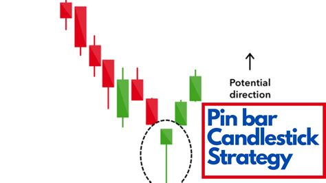
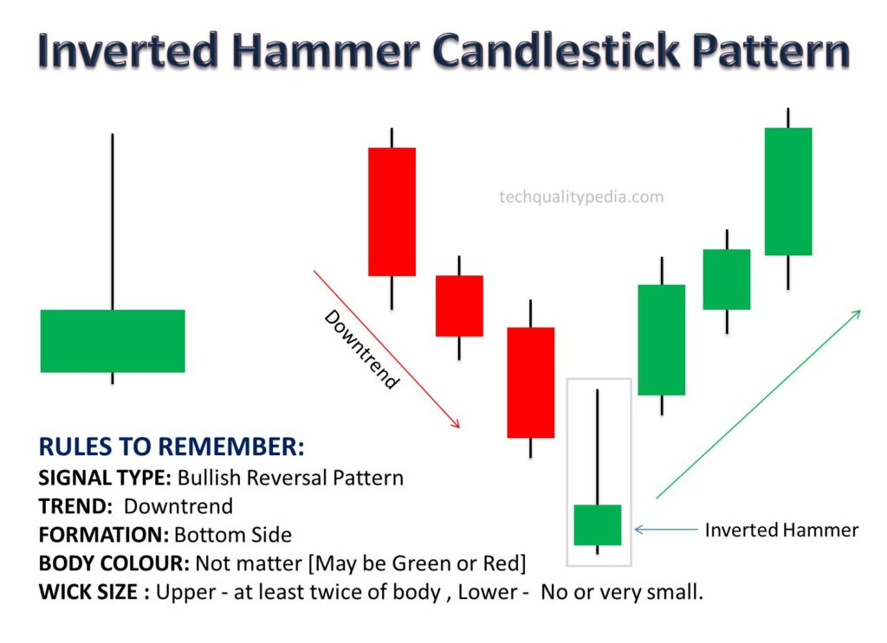
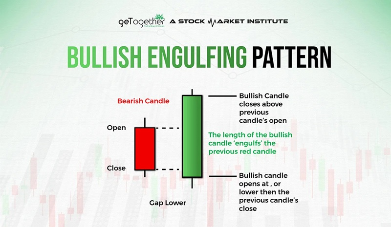

##🟦 FLOWCHART – HYBRID SYSTEM

---
เริ่ม
 ↓
ดูเทรนด์ใหญ่ H4/H1
 ├─ ขาขึ้น → โฟกัส Buy
 └─ ขาลง  → โฟกัส Sell
 ↓
ตี Trendline + วัด Fibo + วาด Channel
 ↓
ราคาอยู่โซนไหน?

(1) อยู่บนแนวรับ Fibo 61–78%
    ↓
    รอแท่งกลับตัว (Pin bar / Engulfing) ที่ H1/M30
    ↓
    เข้า Buy/Sell ตามเทรนด์ (Entry A)
    SL = ทะลุ 100%
    TP = 0% หรือ RR ≥ 1:2

(2) ราคา Breakout Trendline
    ↓
    รอการยืนเหนือ / ใต้ Trendline
    ↓
    เข้า Buy/Sell แบบต่อเทรนด์ (Entry B)
    SL = กลับเข้าเส้น TL อีกครั้ง
    TP = Swing High / Low

(3) ราคาแตะกรอบ Channel บน/ล่าง
    ↓
    ดูแท่งกลับตัวแรง เช่น Engulfing
    ↓
    เข้าแบบสวนเทรนด์ระยะสั้น (Entry C)
    SL = หลุดกรอบ Channel 1 ช่วงแท่ง
    TP = กลับไปกลาง Channel (Midline)

เมื่อราคาไปถึง +38.2%
 ↓
เลื่อน SL → บริเวณ 61.8% เพื่อกันกำไร

จบไม้

---
🟧 คำอธิบายระบบ Hybrid แบบสั้น
A) Fibo Pullback (ไม้แรกที่สวยสุด)

ใช้เมื่อเทรนด์ชัดเจน

จุดเข้าอยู่ระหว่าง 61.8–78.6% ของรอบก่อน

เป็นไม้ที่มี RR สูงที่สุด

B) Trendline Breakout

ใช้เมื่อราคาเริ่ม “หนีออกจาก Trendline” ตามภาพที่คุณส่ง

ต้องมีแท่งปิด เหนือ/ใต้ Trendline

เป็นสัญญาณการเดินต่อของเทรนด์หลัก

C) Channel Reversal

สำหรับจังหวะสวนเทรนด์แบบปลอดภัย (เฉพาะ H1/H4 เท่านั้น)

เข้าเมื่อราคาแตะ ขอบ Channel + แท่งกลับตัวแรง

TP แค่กลาง Channel ก็พอ (อย่าโลภ)

🟩 จังหวะที่ดีที่สุด (เรียงลำดับความแม่นยำ)

Fibo 61–78% + Pin bar / Engulfing → แม่นสุด

Breakout Trendline + ยืนเหนือเส้น → มาตรฐานสูงมาก

Channel Reversal → สวนได้แต่ RR ต้องคุมให้ดี
---
📌 ตัวอย่าง: Pin Bar / Hammer / Engulfing (ดูง่าย ชัด ใช้ได้จริง)

🔥 1) Pin Bar
## 📌 Pin Bar

 

สัญญาณกลับตัว เมื่อไส้แท่งยาวไปทางหนึ่ง และตัวแท่งเล็กมาก

ถ้าไส้ยาวอยู่ด้านล่าง → สัญญาณขึ้น (Bullish Pin Bar)

ถ้าไส้ยาวอยู่ด้านบน → สัญญาณลง (Bearish Pin Bar)

ใช้ดีสุดเมื่อเกิด ที่แนวรับ/แนวต้าน หรือ Fibonacci Zone

🔥 2) Hammer

## 📌 Hammer

 

Hammer = รูปแบบกลับตัวขาขึ้น

ไส้ล่างยาว

ตัวแท่งเล็ก

เกิดหลังจากราคาไหลลงมาระยะหนึ่ง

ถ้า Volume เพิ่ม → ยิ่งแรง

🔥 3) Engulfing (Bullish / Bearish)

## 📌 Bullish Engulfing

 

Bullish Engulfing

แท่งเขียวใหญ่ กลืนแท่งแดงก่อนหน้า

บ่งบอกแรงซื้อกลับตัว

Bearish Engulfing

แท่งแดงใหญ่ กลืนแท่งเขียวก่อนหน้า

สัญญาณกลับตัวลงแรง

📌 Engulfing คือสัญญาณที่แม่นที่สุดในการเล่นสวนเทรน (ถ้าประกอบกับระดับโซนที่แข็งแรง)

📌 ถ้าเอาแบบ “สูตรเข้าเร็ว”

คุณชอบตีเทรน / แนวรับ-ต้าน / RSI Zone
งั้นสูตรสำหรับ TF 30s – 5m ที่สะอาดมาก มี 3 แบบ:

---

⚙️ สูตร 1 : Break–Retest แบบเร็ว

(ใช้กับ TF 30s / 1m / 5m ได้)

หาเส้น Trendline (บน/ล่าง)

รอแท่งหลุด TL แบบชัด (มี Body ออกนอกเส้น ไม่ใช่แค่ไส้)

รอราคา ดึงกลับมาจูบเส้น (retest)

เข้าเมื่อเกิด candlestick signal เช่น

Pin Bar

Engulfing

Hammer

SL หลังไส้แท่ง signal
TP RR = 1:2 / 1:3

สูตรนี้ใช้ได้ดีมากกับ BTC ที่วิ่งแรง

---

⚙️ สูตร 2 : ซื้อ Oversold เท่านั้น

RSI < 30 (Oversold)

แตะ Zone แนวรับ

เกิด Hammer หรือ Bullish Pin Bar

ถ้ามี Divergence ยิ่งดีมาก

เข้าเร็วมากเหมาะกับ Scalping โดยเฉพาะ TF 1m

---

⚙️ สูตร 3 : สวนเทรนแบบปลอดภัย (Counter-Trend Safe)

ใช้เฉพาะตอนราคาเข้ากรอบสุดปลายแล้ว

มี Trendline Principal (เส้นใหญ่)

ราคาเข้าใกล้ปลาย trend (climax zone)

RSI >70 (overbought) หรือ <30 (oversold)

Candle สวนแบบ Engulfing หรือ Pin Bar ยาว

Volume แสดงการเทขายหรือเทซื้อชัด

เป็นสูตรสวนที่แม่นที่สุด แต่ต้องใช้เฉพาะ “ปลายเทรนจริง ๆ”

---
## 📌 Lot Size Calculator (Manual Formula)

**สูตร:** 

Lot size = Money_to_risk / (StopLoss_in_pip × PipValue_per_Lot)

[lot](callot.html)

### ตัวอย่าง EURUSD
- เงินที่ยอมขาดทุน = 10 USD  
- SL = 50 pip  
- Pip value = 10$ ต่อ 1 lot  

Lot = 10 / (50 × 10) = 0.02 lot

### ตัวอย่าง GBPUSD
- เงินที่ยอมขาดทุน = 10 USD  
- SL = 80 pip  
- Pip value = 10$ ต่อ lot  

Lot = 10 / 800 = 0.0125 ≈ 0.01 lot

### Crypto (BTCUSD – XM Micro)
Lot size = Risk / (SL × Tick value)

Copy code
Example: SL = 300 จุด, Risk = 10$
Lot = 10 / (300 × 0.01) = 3.33 micro lot

